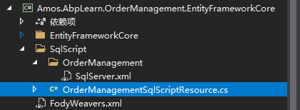
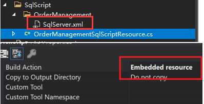

This repository is an extension based on Volo Abp(https://github.com/abpframework/abp)  

- [Automatically add entities to the DbContext Model](#automatically-add-entities-to-the-dbcontext-model)
- [Temp Table](#temp-table)
- [Sql Script](#sql-script)

# Automatically add entities to the DbContext Model
1. As normal, create your Entity class in the Domain layer
2. Add the `Amos.Abp.EntityFrameworkCore` Nuget package to your EntityFrameworkCore layer
3. Using `AutoAddEntityToModelAttribute` tag your DbContext interface
    ```C#
    [AutoAddEntityToModel(typeof(YourDomainModule))]
    public interface IYourDbContext : IEfCoreDbContext
    {
    }
    ```
4. Call the `AutoAddEntityTypeToModel` method in your DbContext class (Note: Call it before base.OnModelCreating)
    ```C#
    [ConnectionStringName(YourDbProperties.ConnectionStringName)]
    public class YourDbContext : AbpDbContext<YourDbContext>, IYourDbContext
    {
        public YourDbContext(DbContextOptions<YourDbContext> options): base(options)
        {
        }

        protected override void OnModelCreating(ModelBuilder builder)
        {
            builder.AutoAddEntityTypeToModel(this);//Note: Call it before base.OnModelCreating
            base.OnModelCreating(builder);
            builder.ConfigureYourModule();
        }
    }
    ```
5. Follow Volo abp modular best practices, configure the automatically add entities in your ModuleDbContextModelCreatingExtensions
    ```C#
    public static class YourModuleDbContextModelCreatingExtensions
    {
        public static void ConfigureYourModule(
            this ModelBuilder builder,
            Action<YourModuleModelBuilderConfigurationOptions> optionsAction = null)
        {
            Check.NotNull(builder, nameof(builder));

            var options = new YourModuleModelBuilderConfigurationOptions(
                YourDbProperties.DbTablePrefix,
                YourDbProperties.DbSchema
            );

            optionsAction?.Invoke(options);

            builder.ConfigureAutoAddEntityTypes<IYourDbContext>((entityType) => (b) =>
            {
                b.ToTable(options.TablePrefix + entityType.Name, options.Schema);
                b.ConfigureByConvention();
            });

            builder.ApplyConfigurationsFromAssembly(Assembly.GetExecutingAssembly());
        }
    }
    ```
    You are advised to configure the index, Key, etc., by implementing the EfCore `IEntityTypeConfiguration` interface, at your EntityFrameworkCore layer
    ```C#
    public class ProductConfiguration : IEntityTypeConfiguration<Product>
    {
        public void Configure(EntityTypeBuilder<Product> builder)
        {
            builder.HasIndex(h => h.Name).HasFilter("IsDeleted=0").IsUnique();
        }
    }
    ```
    Then by calling the `builder.ApplyConfigurationsFromAssembly(Assembly.GetExecutingAssembly())`  configuration entity, just like the example above

6. Register automatically add entities repository and DependsOn in your EntityFrameworkCoreModule, use `AddAbpDbContextEx` instead of `AddAbpDbContext`
    ```C#
    [DependsOn(typeof(YourDomainModule))]
    [DependsOn(typeof(AmosAbpEntityFrameworkCoreModule))]
    public class YourEntityFrameworkCoreModule : AbpModule
    {
        public override void ConfigureServices(ServiceConfigurationContext context)
        {
            context.Services.AddAbpDbContextEx<OrderManagementDbContext>(options =>{});
        }
    }
    ```  
7. Finally, as normal, you can inject automatically add entity repository to use
    ```C#
    public class YourAppService : IYourAppService
    {
        private readonly Lazy<IRepository<XXEntity, long>> _xxRepositoryLazy;

        public YourAppService(Lazy<IRepository<XXEntity, long>> xxRepositoryLazy)
        {
            _xxRepositoryLazy = xxRepositoryLazy;
        }
    }
    ```

# Temp Table
+ What is an SQL Temp Table (https://www.databasestar.com/sql-temp-table/)
+ At present, only SQL Server Temp Table is implemented. If you use other database provider, you can expand the database support by implementing `ITempTableCreator`, `ITempTableBulkExecutor` interfaces

1. Add the `Amos.Abp.Domain` Nuget package to your Domain layer
2. Create TempTable class in the Domain layer
    ```C#
    public class YourTempTable : ITempTable
    {
        public int Id { get; set; }
    }
    ```
3. Define a temp table repository interface in the Domain layer
    ```C#
    public interface IYourTempTableRepository : ITempTableRepository
    {
    }
    ```
4. Add the `Amos.Abp.TempTable.SqlServer` Nuget package to your EntityFrameworkCore layer
5. Using `AutoAddTempTableToModelAttribute` tag your DbContext interface
    ```C#
    [AutoAddTempTableToModel(typeof(YourDomainModule))]
    public interface IYourDbContext : IEfCoreDbContext
    {
    }
    ```
6. Call the `AutoAddTempTableToModel` method in your DbContext class (Note: Call it before base.OnModelCreating)
    ```C#
    [ConnectionStringName(YourDbProperties.ConnectionStringName)]
    public class YourDbContext : AbpDbContext<YourDbContext>, IYourDbContext
    {
        public YourDbContext(DbContextOptions<YourDbContext> options): base(options)
        {
        }

        protected override void OnModelCreating(ModelBuilder builder)
        {
            builder.AutoAddTempTableToModel(this);//Note: Call it before base.OnModelCreating
            base.OnModelCreating(builder);
        }
    }
    ```
7. Implement temp table repository in the EntityFrameworkCore layer
    ```C#
    public class YourTempTableRepository : EfCoreTempTableRepository<IYourDbContext>, IYourTempTableRepository, ITransientDependency
    {
        public YourTempTableRepository(IDbContextProvider<IYourDbContext> dbContextProvider) 
            : base(dbContextProvider)
        {
        }
    }
    ```
8. Add DependsOn to your EntityFrameworkCoreModule 
    ```C#
    [DependsOn(typeof(AmosAbpTempTableSqlServerModule))]
    public class YourEntityFrameworkCoreModule : AbpModule
    {
    }
    ```
9.  Finally, you can inject temp table repository to use
    ```C#
    public class YourAppService : IYourAppService
    {
        private readonly Lazy<IYourTempTableRepository> _yourTempTableRepositoryLazy;
        private readonly Lazy<IRepository<XXEntity, long>> _xxRepositoryLazy;

        public YourAppService(Lazy<IYourTempTableRepository> yourTempTableRepositoryLazy,Lazy<IRepository<XXEntity, long>> xxRepositoryLazy)
        {
            _yourTempTableRepositoryLazy = yourTempTableRepositoryLazy;
            _xxRepositoryLazy=xxRepositoryLazy;
        }

        public async Task TestAsync()
        {
            var tempDatas = new List<YourTempTable> { new YourTempTable { Id = 1 }, new YourTempTable { Id = 2 } };
            var tempQuery = await _yourTempTableRepositoryLazy.Value.InsertIntoTempTableAsync(tempDatas);

            var query = await _xxRepositoryLazy.Value.GetQueryableAsync();
            var tempWhereQuery = query.Where(w => tempQuery.Any(a => a.Id == w.Id));
            var tempWhereResult = await _xxRepositoryLazy.Value.AsyncExecuter.ToListAsync(tempWhereQuery);
        }
    }
    ```

# Sql Script
+ This feature is used to perform high-performance database operations using native sql
+ Centralized management of sql scripts
+ Easily supports multiple different database provider(MySql, SqlServer, Oracle, etc. please see the `Volo.Abp.EntityFrameworkCore.EfCoreDatabaseProvider`), Reduce the impact of different database provider sql syntax differences
+ Based on EFCore, Dapper makes almost no disruptive adjustments to the original configuration
1. Add the `Amos.Abp.Domain` Nuget package to your Domain layer
2. Define a sql script repository interface in the Domain layer
    ```C#
    public interface IYourSqlScriptRepository : ISqlScriptRepository
    {
    }
    ```
3. Add the `Amos.Abp.SqlScript` Nuget package to your EntityFrameworkCore layer
4. Create sql script resource file in the EntityFrameworkCore layer (Similar to defining multilingual resource files, Please refer to the screenshot below)   
  
    + Create a SqlScript folder, and define an sql script resource empty class in this folder
        ```C#
        public class YourSqlScriptResource
        {
        }
        ```
    + Create a folder with the same name as the sql script resource empty class
    (eg: create a folder name `OrderManagement` for `OrderManagementSqlScriptResource`)
    + Create sql script xml file for your database provider, and <b><font color="Red">set it as an embedded resource</font></b>
    
        ```xml
        <?xml version="1.0" encoding="utf-8" ?>
        <SqlScripts Namespace="OrderManagement" DatabaseProvider="SqlServer" >
	        <Item Key="SelectProductById">select * from Order where Id=@Id</Item>
	        <Item Key="SoftDeleteProductById">update Order set IsDelete=1 where Id=@Id</Item>
	        <Item Key="SelectDynamicTableById">select * from {{table}} where Id=@Id</Item>
	        <Item Key="TestMultiline">
		        select * from Order where Id=@Id;
		        select * from OrderItems
	        </Item>
        </SqlScripts>
        ``` 
        Note: [Namespace] and [DatabaseProvider] are correctly filled in the xml
  
    +  Configure `SqlScriptOptions` and add DependsOn in your EntityFrameworkCoreModule
        ```C#
        [DependsOn(typeof(AmosAbpSqlScriptModule))]
        public class YourEntityFrameworkCoreModule : AbpModule
        {
            public override void ConfigureServices(ServiceConfigurationContext context)
            {
                Configure<SqlScriptOptions>(options =>
                {
                    options.AddResource("YourDefinedSqlScriptNamespace", typeof(YourSqlScriptResource));
                });
            }
        }
        ```
        Note: [YourDefinedSqlScriptNamespace] is same as xml file [Namespace]
5. Implement sql script repository in the EntityFrameworkCore layer
    ```C#
    public class YourSqlScriptRepository : SqlScriptRepository<IYourDbContext>, IYourSqlScriptRepository, ITransientDependency
    {
        public YourSqlScriptRepository(IDbContextProvider<IProductManagementDbContext> dbContextProvider, ISqlScriptProvider sqlScriptProvider) 
            : base(dbContextProvider, sqlScriptProvider)
        {
        }
    }
    ```
6. Finally, you can inject temp table repository to use
    ```C#
    public class YourAppService : IYourAppService
    {
        private readonly Lazy<IYourSqlScriptRepository> _yourSqlScriptRepositoryLazy;

        public YourAppService(Lazy<IYourSqlScriptRepository> yourSqlScriptRepositoryLazy)
        {
            _yourSqlScriptRepositoryLazy = yourSqlScriptRepositoryLazy;
        }

        public async Task TestAsync()
        {
            var ds = await _yourSqlScriptRepositoryLazy.Value.QueryAsDataSetAsync("OrderManagement:TestMultiline", sqlParam: new { Id = 1 });
            var dt = await _yourSqlScriptRepositoryLazy.Value
            .QueryAsDataTableAsync("OrderManagement:SelectDynamicTableById",new { table= "Order" }, new { Id = 1 });        
        }
    }
    ```
    Note: sql scirpt depends on the database provider you set in DbContext (Get database provider : `((EfCoreDatabaseProvider)dbContext.Model["_Abp_DatabaseProvider"]`, if your DbContext setting uses SqlServer, sql scirpt in SqlServer.xml will be used, if your DbContext setting uses SqlServer MySql, sql scirpt in MySql.xml will be used)
